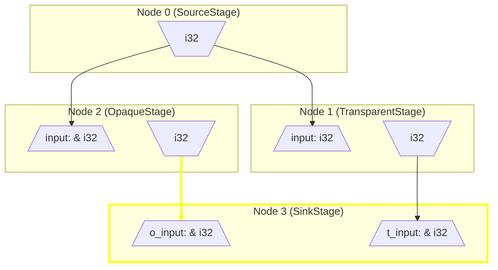

# directed

This crate is a Directed-Acyclic-Graph (DAG)-based evaluation system for Rust. It allows you to wrap functions in a way that converts them into stateful Nodes in a graph. These can then be executed in the shortest-path to be able to evaluate one or more output nodes. Inputs and outputs can be cached (memoization), and nodes can have internal state (or not, anything can be stateless as well). Graph connections can be rewired at runtime without the loss of node state.

Here is a visualization of a trivial program structure using this:


## Current project status

- A significant rewrite is almost complete. 0.2 is coming soon and will be a much more mature verison of this crate.

## Core API Concepts

### Stage

A `Stage` is a wrapped function that can be used to create a `Node`. Think of a `Stage` as a definition and a `Node` as a stateful instantiation.   

When a function is annotated with the `#[stage]` macro, it will be converted to a struct of the same name, and given an implementation of the `Stage` trait. For this reason, struct naming conventions should be followed rather than function naming conventions:
```rust
use directed::*;

#[stage]
fn SimpleStage() -> String {
    String::from("Hello graph!")
}
```

#### Multi-output
Stages can support multiple named outputs by making use of `out` sttribute and the `output` macro. This can be used to make connections between specific outputs of one node to specific inputs of another:
```rust
use directed::*;

// When multiple outputs exist, they must be specified within 'out'. Syntax is siumilar to typical input arguments.
#[stage(out(output1: u32, output2: String))]
fn MultiOutputStage() -> _ {
    let output2 = String::from("Hello graph!");
    output! {
        output1: 42,
        // Typical struct creation rules apply, no need to specify the name twice
        output2
    }
}
```

#### Lazy
Stages can be annotated as `lazy`. This will indicate that its node will never be evaluated until a child node needs its output to evaluate. Typical graphs will have multiple lazy nodes, and one or possibly a few non-lazy nodes. A graph with only lazy nodes will do nothing at all:
```rust
use directed::*;

#[stage(lazy)]
fn LazyStage() -> String {
    String::from("Hello dependant node!")
}
```

#### Cache Last
Stages can be annotated as `cache_last`. This will indicate that if reevaluated with identical inputs to the previous evaluation, it will just return cached outputs without rerunning the function:
```rust
use directed::*;

// If this is run with 31 as an input twice, "to_string" will not be called the 2nd time.
#[stage(cache_last)]
fn CacheLastStage(num: u32) -> String {
    num.to_string()
}
```

Preconditions:
- All inputs must be `PartialEq` (compile-time error if condition is not met)
- All inputs and outputs must be `Clone` (compile-time error if condition is not met)

#### Cache All
Stages can be annotated with `cache_all`. This means that for any previously identical input, return the associated output without reevaluating.

Preconditions:
- All previous conditions for `cache_last`
- All inputs must be `Hash`

#### State

Stages can be annotated with `state`. This will indicate fields that can be used to store internal state for the node. This could also be used to store some kind of configuration for the node that might be modified outside the graph's evaluation time. State is never accessed by other nodes or transferred throughout the graph in any way. Fields are always accessible as `&mut` references within the body of the stage:
```rust
use directed::*;

// Use `state(name: TypeOfState)` to indicate the usage of state
#[stage(state(num_times_run: u32, some_string: String))]
fn StatefulStage() -> String {
    // this will automatically put an '&mut SomeState' in scope called 'state'
    let result = if *num_times_run == 0 {
        format!("I've never been run!")
    } else {
        format!("I've been run {} times.", num_times_run)
    };
    *num_times_run += 1;
    result
}
```

See the [#Node State]() section for details on how to initlialize the state.

It is possible to access or mutate state outside of graph evaluation. See the `Registry` section for more details.

### Registry

A `Registry` stores nodes and their state. It's distinctly seperate from `Graph` itself which just stores information on how nodes are connected. This come swith a few benefits:
- Any number of distinct `Graph`s can be created for a single `Registry`. Node state (including cached inputs and outputs) can be reused to evaluate a single graph or among distinct graphs.
- To evaluate a graph, an `&mut Registry` is passed in. Graphs don't take exclusive ownership of the registry, and are thus stateless.

Here's an example of creating a registry and adding nodes to it:
```rust
use directed::*;

#[stage]
fn SimpleStage() -> String {
    String::from("Hello graph!")
}

fn main() {
    let mut registry = Registry::new();
    // This returns a NodeId, which can be used to lookup the node in the registry.
    let node_1 = registry.register(SimpleStage);
}
```

### Node State

As mentioned in the `Stage` section, nodes can have internal state. When creating a node, the following method is provided:
```rust,ignore
let mut registry = Registry::new();
let node_1 = registry.register_with_state(StatefulStage, state!(StatefulStage { num_times_run: 0 }));
// `registry.register(StageName)` can be used when state is not needed.
```
The `state!` macro uses struct-construction syntax to initialize state fields.

State can also be accessed via one of these methods:
```rust,ignore
let mut registry = Registry::new();
let node_1 = registry.register(StatefulStage);
// Get a reference to internal state
println!("Node 1 state: {:?}", registry.state(node_1));
// Get a mutable reference to internal state
registry.state_mut(node_1).num_times_run = 10;
```

### Graph

Putting it all together, the `Graph` struct stores node IDs and the connections between the outputs of nodes to the inputs of other nodes. Creating one is easy, and the `graph` macro exists to make the connections more visually intuitive. See the example below of putting a variety of concepts together and finally making a graph:
```rust
use directed::*;

#[stage(lazy, cache_last)]
fn TinyStage1() -> String {
    println!("Running stage 1");
    String::from("This is the output!")
}

#[stage(lazy)]
fn TinyStage2(input: String, input2: String) -> String {
    println!("Running stage 2");
    input.to_uppercase() + " [" + &input2.chars().count().to_string() + " chars in 2nd string]"
}

#[stage]
fn TinyStage3(input: String) {
    println!("Running stage 3");
    assert_eq!("THIS IS THE OUTPUT! [19 chars in 2nd string]", input);
}

fn main() {
    let mut registry = Registry::new();
    let node_1 = registry.register(TinyStage1);
    let node_2 = registry.register(TinyStage2);
    let node_3 = registry.register(TinyStage3);

    // This macro is basic syntax sugar for a few calls.
    let graph = graph! {
        // Nodes that will be a part of the graph must be defined.
        nodes: (node_1, node_2, node_3),
        connections: {
            // The below uses unnamed outputs only. Named outputs can be
            // indicated the same way as named inputs, `node_name: output_name`
            node_1 => node_2: input,
            node_1 => node_2: input2,
            node_2 => node_3: input,
            // It is also possible to make connections between nodes without
            // any data being passed between them by leaving out the names 
            // of both the input and output parameters:
            // `node_name => dependant_node_name`
        }
    }
    .unwrap();

    // This will do the following:
    // - Find the first non-lazy node (node_3).
    // - Recursively evaluate it's parents (so node_3 will request node_2, which will request node_1 twice)
    // - node_1 will evaluate, printing "Running stage 1", and pass a clone of its output to "input" on node_2.
    // - node_1 will not evaluate again, and just pass a clone of its output to "input2" on node_2.
    // - node_2 will evaluate, printing its output then moving (no`t cloning) its output to node_3.
    // - node_3 will evaluate, printing its output that passing the assert successfully.
    graph.execute(&mut registry).unwrap();
}
```

As stated before, multiple graphs can be created from that same registry, executed in any order.

###### TODO: Update all the below sections of the README for 0.2 ####################################

#### Access node inputs, outputs, and state

```rust
use directed::*;

#[stage(out(string_out: String), state(example_state: u8))]
fn TinyStage1() -> _ {
    output!{
        string_out: String::from("This is the output!")
    }
}

let mut registry = Registry::new();
let node_1 = registry.register_with_state(TinyStage1, state!(TinyStage1 {example_state: 10}));
let graph = graph! {
    nodes: (node_1),
    connections: {}
}
.unwrap();

graph.execute(&mut registry).unwrap();

let outputs = registry.get_outputs(node_1);

assert_eq!(
    outputs.unwrap().string_out,
    Some(String::from("This is the output!"))
)
```

This can also be used to insert inputs into unconnected nodes of graphs, allowing interaction between the graph-based workflow and other arbitrary sources of data.

## Features

### tokio

The `tokio` feature adds async evaluation. This simply means that a node will evaluate all of its parents nodes concurrently before evaluating itself. Enabling this kind of execution is simple:
- Enable the `tokio` feature
- Wrap your graph in an `Arc`: `let graph = Arc::new(graph);`
- Instead of calling `execute`, call `execute_async` on the `Arc<Graph>`.

Stages marked `async` will behave as expected - executing within the async context.

TODO: Add pallatable example. For now, [Take a look at this test for an example](https://github.com/Eolu/directed/blob/ca34d23a32703162a011f39e578bc4e5e5dda0c8/directed/src/lib.rs#L677).

## WIP features/ideas/TODOs

- High priority: Handle when a node is unavailable from the registry in async execution (wait until it's available again)
    - There is in general more testing and work needed around this bullet. The registry serves as a node library that hands out nodes to be evaluated - and expects them to be returned when evaluation is done. Right now it will just give up if it attempts to concurrently execute the same node at the same time. Waiting is easy - but there are likely some situations where it CAN be valid to execute the same node at the same time. This will take a bit of plumbing in the proc macro.
- Automatic validators to make sure correct input and output types are present if required (right now this would halt graph evaluation mid-way through and give an error, but there's no reason it can't do that before even starting evaluation)
- Outside of async some Send+Sync bounds can be relaxed, some Arc usage can be replaced with Rc
- Improve error system to be cleaner (it works but the different types of errors feel non-intuitive)
- A Graph + Registry could be combined to create a Node (with a baked stage). Right now we combine nodes with stages to make the registry, and registries with graphs. If we could instead combine STAGES with graphs, then output a valid registry full of nodes based on that combination, it would avoid the possibility of combining a registry with an invalid graph entirely. (or even, full graph sharding?)
- An attribute that makes it serialize the cache and store between runs (this may be out of scope, but if so at least make sure the design doesn't prohibit someone from doing this).
- A way to reset all registry state at once (probably only slightly harder to implement than it was to write this bullet point)
- `get_output` and `inject_input` could probably be more elegant than they currently are
- Make a cool visual "rust playgraph" based on this crate
    - Ability to create stages, and compile
    - Ability to create nodes from stages, and attach them and execute (without recompiling!)
- State names are usable within the stage function, but when inserting or accessing state you just get a tuple without name preservation (but with order preservation). This isn't quite ergonamic as I'd like, so ways to acces state by name should be included (likely by generating a struct with the names - maybe everything should generate within a module to prevent namespace pollution)