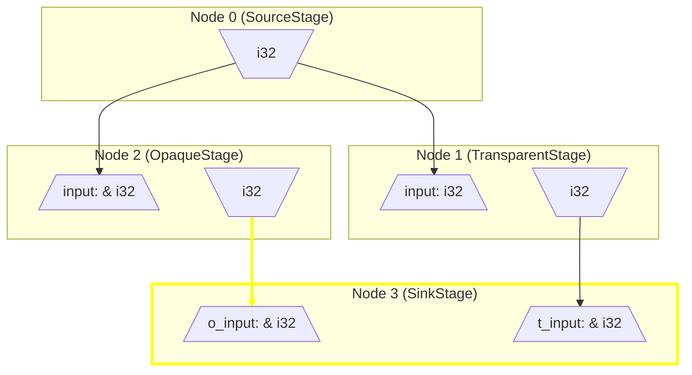

# directed

This crate is a Directed-Acyclic-Graph (DAG)-based evaluation system for Rust. It allows you to wrap functions in a way that converts them into stateful Nodes in a graph. These can then be executed in the shortest-path to be able to evaluate one or more output nodes. Inputs and outputs can be cached (memoization), and nodes can have internal state (or not, anything can be stateless as well). Graph connections can be rewired at runtime without the loss of node state.

Here is a visualization of a trivial program structure using this:


When possible, the error types in this crate contain a trace of the graph and have the ability to generate a mermaid graph like the above, highlighting areas relevant to the error output. These can be placed into markdown or into an [online viewer](https://mermaid.live/). 

## Current project status

- WIP: Examples work but many intended features are still missing, and the codebase structure is in general in an "under-construction" state. TODOs littered throughout the codebase need to be extracted out into a coherent plan.

## Core API Concepts

### Stage

A `Stage` is a wrapped function that can be used to create a `Node`. Think of a `Stage` as a definition and a `Node` as a stateful instantiation.   

When a function is annotated with the `#[stage]` macro, it will be converted to a struct of the same name, and given an implementation of the `Stage` trait. For this reason, struct naming conventions should be followed rather than function naming conventions:
```rust
use directed::*;

#[stage]
fn SimpleStage() -> String {
    String::from("Hello graph!")
}
```

#### Multi-output
Stages can support multiple named outputs by making use of the `NodeOutput` type and the `output` macro. This can be used to make connections between specific outputs of one node to specific inputs of another:
```rust
use directed::*;

// When multiple outputs exist, they must be specified within 'out'. Syntax is siumilar to typical input arguments.
#[stage(out(output1: u32, output2: String))]
fn MultiOutputStage() -> NodeOutput {
    let output2 = String::from("Hello graph!");
    output! {
        output1: 42,
        // Typical struct creation rules apply, no need to specify the name twice
        output2
    }
}
```

#### Lazy
Stages can be annotated as `lazy`. This will indicate that it's node will never be evaluated until a child node needs its output to evaluate. Typical graphs will have multiple lazy nodes, and one or possibly a few non-lazy nodes. A graph with only lazy nodes will do nothing at all:
```rust
use directed::*;

#[stage(lazy)]
fn LazyStage() -> String {
    String::from("Hello dependant node!")
}
```

#### Cache Last
Stages can be annotated as `cache_last`. This will indicate that if reevaluated with identical inputs to the previous evaluation, it will just return cached outputs without rerunning the function:
```rust
use directed::*;

// If this is run with 31 as an input twice, "to_string" will not be called the 2nd time.
#[stage(cache_last)]
fn CacheLastStage(num: u32) -> String {
    num.to_string()
}
```

Preconditions:
- All inputs must be `PartialEq` (compile-time error if condition is not met)
- All inputs must be `Clone` (compile-time error if condition is not met)
- Outputs must be `Clone` UNLESS all connected child nodes take input only by reference (runtime error neither of these conditions are met)

#### Cache All
TODO: Not yet implemented

Once implemented this will do true memoization - for any previously identical input, return the associated output without reevaluating.

Preconditions:
- All previous conditions for `cache_last`
- All inputs must be `Hash`

### Registry

A `Registry` stores nodes and their state. It's distinctly seperate from `Graph` itself which just stores information on how nodes are connected. This come swith a few benefits:
- Any number of distinct `Graph`s can be created for a single `Registry`. Node state can be reused to evaluate a single graph or among distinct graphs.
- To evaluate a graph, an `&mut Registry` is passed in. Graphs don't take exclusive ownership of the registry, and are thus stateless.

Here's an example of creating a registry and adding nodes to it:
```rust
use directed::*;

#[stage]
fn SimpleStage() -> String {
    String::from("Hello graph!")
}

fn main() {
    let mut registry = Registry::new();
    // This returns a simple incremented integer ID, which can be used to lookup the node in the registry.
    let node_1 = registry.register(SimpleStage::new());
}
```

### Graph

Putting it all together, the `Graph` struct stores node IDs and the connections between the outputs of nodes to the inputs of other nodes. Creating one is easy, and the `graph` macro exists to make the connections more visually intuitive. See the example below of putting a variety of concepts together and finally making a graph:
```rust
use directed::*;

#[stage(lazy, cache_last)]
fn TinyStage1() -> String {
    println!("Running stage 1");
    String::from("This is the output!")
}

#[stage(lazy)]
fn TinyStage2(input: String, input2: String) -> String {
    println!("Running stage 2");
    input.to_uppercase() + " [" + &input2.chars().count().to_string() + " chars in 2nd string]"
}

#[stage]
fn TinyStage3(input: String) {
    println!("Running stage 3");
    assert_eq!("THIS IS THE OUTPUT! [19 chars in 2nd string]", input);
}

fn main() {
    let mut registry = Registry::new();
    let node_1 = registry.register(TinyStage1::new());
    let node_2 = registry.register(TinyStage2::new());
    let node_3 = registry.register(TinyStage3::new());

    // This macro is basic syntax sugar for a few calls.
    let graph = graph! {
        // Nodes that will be a part of the graph must be defined.
        nodes: [node_1, node_2, node_3],
        connections: {
            // Unnamed outputs are indicated as _. If any of these stages had named outputs, we would put that in its place.
            node_1: _ => node_2: input,
            node_1: _ => node_2: input2,
            node_2: _ => node_3: input,
        }
    }
    .unwrap();

    // This will do the following:
    // - Find the first non-lazy node (node_3).
    // - Recursively evaluate it's parents (so node_3 will request node_2, which will request node_1 twice)
    // - node_1 will evaluate, printing "Running stage 1", and pass a clone of its output to "input" on node_2.
    // - node_1 will not evaluate again, and just pass a clone of its output to "input2" on node_2.
    // - node_2 will evaluate, printing its output then moving (not cloning) its output to node_3.
    // - node_3 will evaluate, printing its output that passing the assert successfully.
    graph.execute(&mut registry).unwrap();
}
```

As stated before, multiple graphs can be created from that same registry, executed in any order.

## WIP features/ideas

- async execution works, but there's quite a bit of repeated code from my prototyping efforts still sitting around
- Make a cool visual "rust playgraph" based on this crate
    - Ability to create stages, and compile
    - Ability to create nodes from stages, and attach them and execute (without recompiling!)
- Improve error system to be cleaner
- A Graph + Registry could be combined to create a Node (with a baked stage). Right now we combine nodes with stages to make the registry, and registries with graphs. If we could istead combine STAGES with graphs, then output a valid registry full of nodes based on that combination, it would avoid the possibility of combining a registry with an invalid graph entirely.
    - Extended idea: Full graph sharding with support for distributed execution
- An attribute that makes it serialize the cache and store between runs
- Accept inputs for top-level nodes, return outputs from leaf nodes
- Automatic validators to make sure correct input and output types are present if required
- Caching ALL possible input combinations, not just previous (cache_all)
- A way to reset all registry state at once
